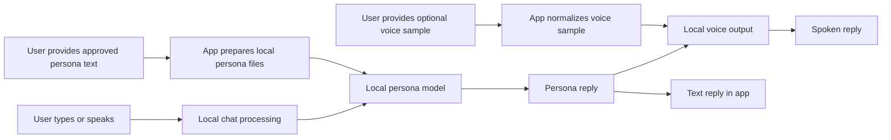

# Persona Chat Local

Persona Chat Local is a private, local-first voice chat app for Apple Silicon Macs. It lets someone build a conversational persona from their own approved text and voice samples, then chat with that persona through a simple desktop interface.

The project is designed for people who want an AI voice/chat experience without sending private runtime conversations to cloud APIs.

## What It Does

- Turns written persona material into a local chat personality.
- Lets a user talk by typing or using the microphone.
- Replies with text, voice, or both.
- Runs the main chat loop locally on the Mac.
- Keeps private persona files, voice samples, logs, and generated audio out of git.

Think of it as a small desktop companion app that can be trained from user-provided material and then run privately on the same computer.

## Who This Is For

This repo may be useful to:

- HR or hiring reviewers who want to understand the product idea quickly.
- Developers who want to inspect the local AI pipeline.
- Privacy-focused users who want local setup instead of cloud runtime calls.
- Builders experimenting with voice, chat, and personal AI interfaces.

## Simple Workflow



## Example: Input To Output

This is a fictional example, not real persona data.

| Step | Example |
| --- | --- |
| User input | "Hey, can you help me plan my day?" |
| Local processing | The app sends the message to the local persona model on the Mac. |
| Persona text output | "Sure. Let's keep it simple: pick three important things, then leave room for breaks." |
| Optional voice output | The app turns the reply into a spoken response using the local voice sample. |

## Privacy In Plain English

The app is built to keep sensitive runtime data local.

Private files are intentionally ignored by git:

- `persona.txt`
- `Modelfile`
- `voice_samples/speaker.wav`
- `temp/`
- `tools/`
- `.venv/`
- `build/`
- `dist/`

Do not commit real chat exports, private voice samples, generated audio, persona prompts, local model folders, or app build outputs unless you fully understand the privacy risk.

## Try The App

The preferred non-technical path is the macOS desktop app:

1. Download the release zip from GitHub Releases.
2. Unzip it.
3. Open `Persona Chat.app`.
4. Use the Setup tab to prepare local requirements and persona assets.

First setup can take a while because the app downloads local model assets.

## Build The App Locally

On Apple Silicon macOS:

```bash
./scripts/build_macos_app.sh
```

This builds the macOS app bundle and release zip:

```text
dist/Persona Chat.app
dist/Persona-Chat-macos-arm64.zip
```

## Run From A Checkout

For development or terminal use:

```bash
source .venv/bin/activate
python gui.py
```

Text-only terminal mode:

```bash
python main.py --input text --output text
```

Voice mode with macOS playback:

```bash
python main.py --input text --output voice --playback afplay
```

## Technical Details

Developers can read the full technical workflow here:

[TECHNICAL_README.md](TECHNICAL_README.md)

It covers the architecture, setup internals, runtime data flow, packaging process, and troubleshooting notes.
