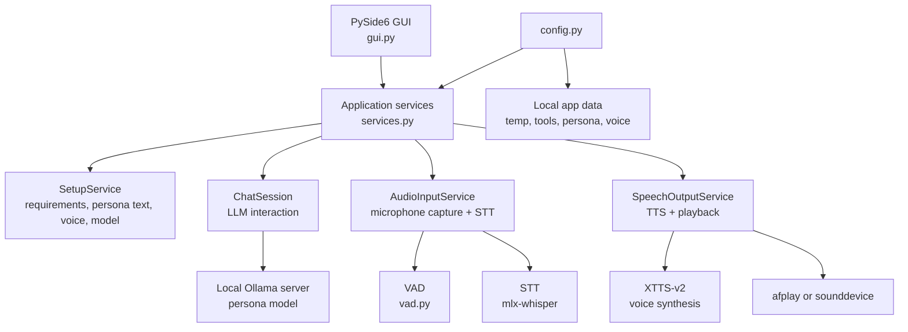
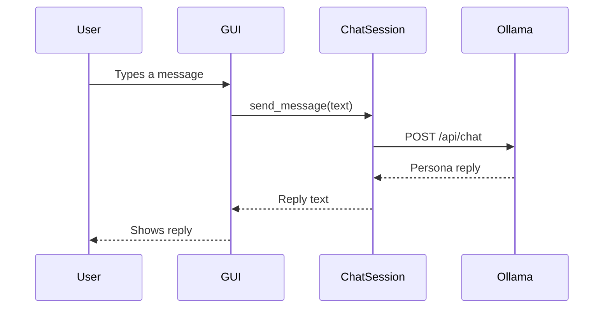
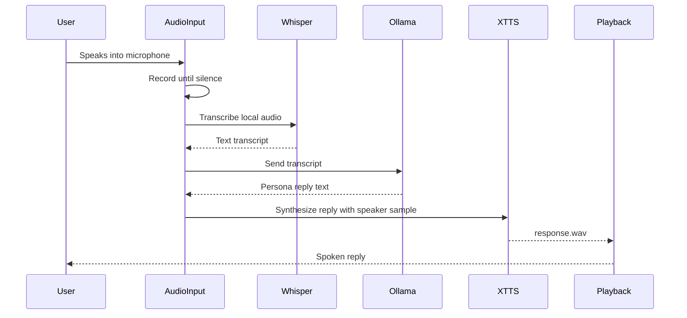
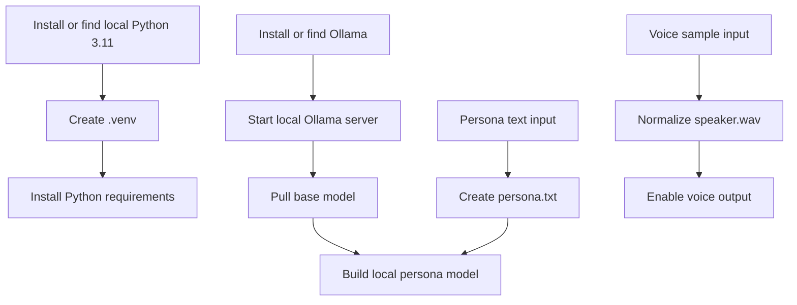

# Persona Chat Local: Technical README

This document explains the engineering workflow behind Persona Chat Local. The main [README.md](README.md) is written for non-technical readers; this file is for developers and reviewers who want to understand how the app works.

## Architecture

Persona Chat Local is a Python desktop app built around a local model pipeline:



Primary modules:

- `gui.py`: desktop interface with Setup and Chat tabs.
- `services.py`: GUI-safe service layer for setup, chat, microphone input, and speech output.
- `main.py`: terminal entry point for text and voice modes.
- `config.py`: central paths and model settings.
- `llm.py`: local Ollama chat client.
- `tts.py`: XTTS-v2 text-to-speech and audio playback.
- `stt.py` and `vad.py`: voice input pipeline.

## Runtime Flow

### Text Input To Text Output



### Voice Input To Voice Output



## Setup Workflow

The Setup tab and `setup.sh` both prepare the same basic ingredients:



Important setup outputs:

- `persona.txt`: raw approved persona text.
- `Modelfile`: generated Ollama model instructions.
- `voice_samples/speaker.wav`: normalized XTTS speaker sample.
- `tools/`: local Python and Ollama assets when installed by the app.
- `temp/`: runtime logs, audio files, and caches.
- `.venv/`: local development virtual environment.

These files are intentionally local and ignored by git.

## Example Processing Flow

Fictional example:

```text
Input:
  "Can you help me plan my day?"

Processing:
  1. GUI receives typed text.
  2. ChatSession sends the text to the local Ollama persona model.
  3. Ollama returns a persona-style reply.
  4. If voice output is enabled, SpeechOutputService sends the reply to XTTS-v2.
  5. XTTS writes temp/response.wav.
  6. afplay or sounddevice plays the audio.

Output:
  Text: "Sure. Start with the three most important things, then leave space for breaks."
  Voice: The same response played through the Mac output device.
```

## App Packaging

The macOS app build is handled by:

```bash
./scripts/build_macos_app.sh
```

The build script:

- creates or reuses a local virtual environment,
- installs runtime and build requirements,
- generates `assets/app_icon.icns` from `assets/app_icon.svg`,
- runs PyInstaller with `packaging/PersonaChat.spec`,
- builds `dist/Persona Chat.app`,
- creates `dist/Persona-Chat-macos-arm64.zip`,
- installs the app into the user Applications folder when run locally,
- migrates local setup data into `~/Library/Application Support/Persona Chat`.

When frozen by PyInstaller, `config.py` uses the app data directory for runtime state instead of the source checkout. That avoids common permission issues with repo-owned `temp/` folders.

## Data And Privacy Boundaries

The repository should contain source code, tests, docs, sample placeholders, and build scripts only.

Do not commit:

- `persona.txt`
- `Modelfile`
- `voice_samples/speaker.wav`
- raw chat exports
- raw voice samples
- `temp/`
- `tools/`
- `.venv/`
- `build/`
- `dist/`
- generated `.wav`, `.mp3`, `.m4a`, `.flac`, `.ogg`, or `.opus` files

The `.gitignore` is written to protect these paths. Before pushing, run:

```bash
git status --short --ignored
```

Ignored private files should appear with `!!`, not as staged files.

## Common Commands

Build the app:

```bash
./scripts/build_macos_app.sh
```

Run the GUI from source:

```bash
source .venv/bin/activate
python gui.py
```

Run terminal text mode:

```bash
python main.py --input text --output text
```

Run terminal voice mode on macOS:

```bash
python main.py --input text --output voice --playback afplay
```

Play a test beep:

```bash
python main.py --test-beep --playback afplay
```

List audio devices:

```bash
python main.py --list-devices
```

Run tests:

```bash
python -m unittest tests.test_gui_worker tests.test_services
```

## Troubleshooting

### Permission denied for `temp/ollama-gui.log`

This usually means the checkout or `temp/` folder is owned by a different macOS user. Prefer the packaged app, which writes runtime data to:

```text
~/Library/Application Support/Persona Chat
```

For source runs, use a checkout owned by the current user or fix the local folder permissions from the owning account.

### App opens but voice crashes or quits

First switch output to text mode. If text mode works, the issue is likely in TTS or audio playback. Try `afplay` before `sounddevice` on macOS.

### TTS takes a long time

XTTS-v2 can take several seconds per response, especially on first use. First setup can also download large local model assets.

### Ollama is not reachable

Start the local server:

```bash
./tools/Ollama.app/Contents/Resources/ollama serve
```

Then retry the app or terminal command.
